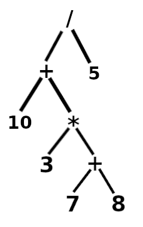

# Math-Interpreter
Math Interpreter collects data from string and calculates the mathematical result for that given expression. The whole program was written in C, because it provides a low level interface of resources and a great modular capability, which enables you to embed this program with a very amount of software and languages.

## Compile and run

The program compiles with *Make*, so to compile it, just type make into the terminal window. The program will generate a several list of object files inside the *build* folder and a *output* file will be created inside the root folder, to run it, just type *./output*. 
The program is called using flags to get information for execution. By default, if the program receive no flags, it will simply show usage information.

### Mode

The program has two modes: *Radians* and *Degrees*. The first one considers PI constant as 180 degrees, and the last one  considers it as 3.14. By default the program executes in *Degree* mode. To change the mode see the [Cummon Flags section](#common-flags).

### Common flags
<table>
  <tr>
    <td>-i flag</td>
    <td>-e flag</td>
    <td>-d flag</td>
    <td>-r flag</td>
    <td>-help flag</td>
  </td>
  <tr>
    <td>Executes the program as an interpreter</td>
    <td>Takes an expression after the flag and returns the result</td>
    <td>Executes in degree mode</td>
    <td>Executes in radian mode</td>
    <td>Show usage and help information</td>
  </tr>
</table>

## Reserverd keywords and functions accepted
The following characters and words will be acceped, they are divided in four categories: *Constants*, *Numbers*, *Functions*, *Operators* and *Separators*.

### Constants
<table>
  <tr>
    <td>PI</td>
    <td>e</td>
  </tr>
  <tr>
  <td>Constant for pi</td>
  <td>Euler's constant</td>
  </tr>
</table>

### Numbers

- Integer numbers
- Float numbers

### Functions

<table>
  <tr>
    <td>sin</td>
    <td>cos</td>
    <td>tan</td>
    <td>abs</td>
    <td>ln</td>
  </tr>
  <tr>
    <td>Sine function</td>
    <td>Cosine function</td>
    <td>Tangent function</td>
    <td>Absolute function</td>
    <td>Natural log function</td>
  </tr>
</table>
<table>
  <tr>
    <td>cossec</td>
    <td>sec</td>
    <td>cotg</td>
    <td>pow</td>
    <td>sqrt</td>
  </tr>
  <tr>
    <td>Cosecant function</td>
    <td>Secant function</td>
    <td>Cotangent function</td>
    <td>Power function</td>
    <td>Square root function</td>
  </tr>
</table>

### Operators

<table>
  <tr>
    <td>+</td>
    <td>-</td>
    <td>*</td>
    <td>/</td>
  </tr>
  <tr>
    <td>Addition</td>
    <td>Subtraction</td>
    <td>Multiplication</td>
    <td>Division</td>
  </tr>
</table>

### Separators

The only separator accepted is the parenthesis separator. It can be the opening paranthesis '(' and the closing parenthesis ')', as well. Separators are useful to set the priority of the expression, for example, the **10 + 10 / 5** is different that **(10 + 10)/5**.

## How it works

The process of interpreting and calculating the mathematical expression is divided in three different steps: *Data Sanitazing*, *Data Structuring* and *Calculating the Result*. Each of these steps will be discussed more deeply in the following topics:

### Data Sanitizing

In this step, the program will split the input into every word the user has given, to do so, the program will first collect every character and test if it matches with the types of data the program should receive normally(Constants, Numbers, Functions and Operators), if any exception occurs, the program will display an error corresponding with the mistake that was made.

### Data Structuring

In this step, the program will convert the given string to its *post fixed* representation, it basically means that the numbers will come first and the operations will come later, and the expression will be organized according with the operator precedence. Example: **2 + (4 - 3)** will be **4 3 - 2 +**. This data can also be represented as a *Binary tree*, a data structure that has two childs or less for every ***Node***. This data structure fits right to this purpose, because it organizes the *Operator* as a parent ***Node***, and the *Operands* as a child. Take the expression **(10 + 3\*(7+8))/5** for example, the corresponding *Binary Tree* will be something like:

  

### Calculating the result

Finally, the *post fixed* result will be filled in a stack data structure, in order that when a data is popped out of it, it will be stored in a argumment variable if it's a number, or it will assign the operation type (sum, subtraction, etc). Doing this, the data that will be organized based in the way a function takes its arguments. For example, given the expression **10 + 2**, the program rather than interpret it as we normally do, it will interpret it as **+ 10 2**, or in the programming context **add(10, 2)**. With all of this done, the program will simply call the function corresponding to the operation which is being calculated, and show the final result to the user.
